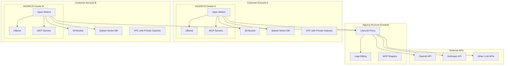
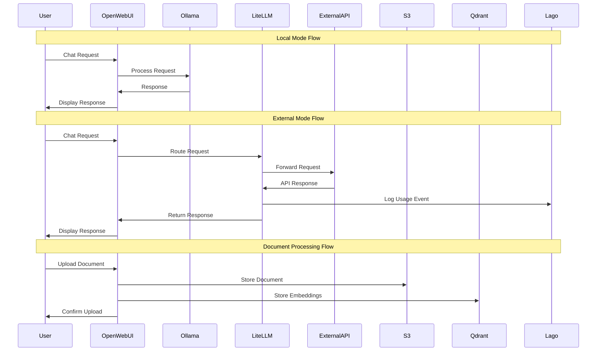

# Design Document

## Overview

The white-label AI assistant platform uses a hybrid multi-tenant architecture that balances data sovereignty with operational efficiency. Customer-specific components run in isolated AWS subaccounts to ensure GDPR compliance, while shared services operate centrally for cost optimization and simplified management.

The architecture supports two primary usage modes:
- **Local Mode**: All AI processing occurs within the customer's environment using Ollama
- **External Mode**: Requests are routed through LiteLLM to external APIs while maintaining usage tracking and billing

## Architecture

### High-Level Architecture



### Network Architecture

Each customer environment operates within an isolated VPC with the following design:

- **Private Subnets**: Host Open WebUI, Ollama, and Qdrant instances
- **Public Subnets**: Host NAT Gateways and Application Load Balancers
- **Security Groups**: Restrict traffic to necessary ports and protocols
- **VPC Endpoints**: Enable secure access to S3 without internet routing

### Data Flow Architecture



## Components and Interfaces

### Customer Stack Components

#### Open WebUI
- **Purpose**: Primary user interface for the AI assistant
- **Deployment**: Container on EKS/ECS with auto-scaling
- **Configuration**: 
  - Environment variables for Ollama and LiteLLM endpoints
  - S3 integration for document storage
  - Qdrant integration for vector search
  - MCP server configuration
- **Scaling**: Horizontal pod autoscaling based on CPU/memory usage
- **Persistence**: Configuration stored in EFS or persistent volumes

#### Ollama
- **Purpose**: Local LLM inference engine
- **Deployment**: Container with GPU support (if available) or CPU-optimized instances
- **Models**: Pre-configured with popular open-source models (Llama, Mistral, etc.)
- **Storage**: Model files stored on EBS volumes with snapshot backups
- **Resource Requirements**: Memory and compute optimized based on model size

#### Qdrant Vector Database
- **Purpose**: Store and search document embeddings
- **Deployment**: StatefulSet with persistent storage
- **Configuration**: 
  - Collections for different document types
  - Indexing parameters optimized for retrieval
  - Backup configuration to S3
- **API**: REST API for embedding operations
- **Scaling**: Vertical scaling with storage expansion

#### S3 Storage
- **Purpose**: Document and file storage
- **Configuration**:
  - Versioning enabled for document history
  - Lifecycle policies for cost optimization
  - Server-side encryption with customer-managed keys
  - Cross-region replication for disaster recovery
- **Access**: VPC endpoints for secure access without internet routing

### Central Stack Components

#### LiteLLM Proxy
- **Purpose**: API gateway for external LLM services with usage tracking
- **Features**:
  - Multi-provider support (OpenAI, Anthropic, Cohere, etc.)
  - Rate limiting and quota management
  - Usage analytics and logging
  - Authentication and authorization
  - Request/response transformation
- **Deployment**: High-availability setup with load balancing
- **Database**: PostgreSQL for configuration and usage data
- **Integration**: Webhook integration with Lago for billing events

#### Lago Billing System
- **Purpose**: Usage-based billing and customer management
- **Features**:
  - Multi-tenant organization management
  - Usage metering and aggregation
  - Invoice generation and payment processing
  - Customer dashboard for usage visibility
  - API for programmatic access
- **Deployment**: Self-hosted with PostgreSQL backend
- **Integration**: Receives usage events from LiteLLM via webhooks

### MCP Integration Layer

#### MCP Server Management
- **Architecture**: Plugin-based system for connecting external tools
- **Configuration**: YAML-based configuration for server definitions
- **Security**: Authentication tokens and access control per customer
- **Monitoring**: Health checks and performance metrics for each MCP server

## Data Models

### Customer Configuration
```yaml
customer:
  id: string
  name: string
  aws_account_id: string
  deployment_region: string
  usage_mode: "local" | "external" | "hybrid"
  billing_config:
    lago_organization_id: string
    litellm_api_key: string
  mcp_servers:
    - name: string
      endpoint: string
      auth_token: string
      enabled: boolean
```

### Usage Event Schema
```json
{
  "customer_id": "string",
  "timestamp": "ISO8601",
  "model": "string",
  "provider": "string",
  "tokens_input": "number",
  "tokens_output": "number",
  "cost_usd": "number",
  "request_id": "string",
  "user_id": "string"
}
```

### Document Metadata Schema
```json
{
  "document_id": "string",
  "customer_id": "string",
  "filename": "string",
  "s3_key": "string",
  "content_type": "string",
  "size_bytes": "number",
  "upload_timestamp": "ISO8601",
  "embedding_status": "pending" | "completed" | "failed",
  "qdrant_collection": "string",
  "qdrant_point_id": "string"
}
```

## Error Handling

### Customer Stack Error Handling
- **Service Failures**: Automatic restart policies with exponential backoff
- **Resource Exhaustion**: Alerts and auto-scaling triggers
- **Data Corruption**: Automated backup restoration procedures
- **Network Issues**: Circuit breaker patterns for external dependencies

### Central Stack Error Handling
- **LiteLLM Failures**: Fallback to alternative providers with graceful degradation
- **Billing System Issues**: Queue usage events for retry processing
- **Authentication Failures**: Clear error messages with resolution guidance
- **Rate Limiting**: Proper HTTP status codes and retry-after headers

### Cross-Stack Error Handling
- **Connectivity Issues**: Health check endpoints with detailed status information
- **Configuration Errors**: Validation at deployment time with rollback capabilities
- **Security Violations**: Immediate alerting and automated response procedures

## Testing Strategy

### Unit Testing
- **Component Tests**: Individual service functionality testing
- **API Tests**: REST API endpoint validation
- **Configuration Tests**: Infrastructure-as-code validation

### Integration Testing
- **End-to-End Flows**: Complete user journey testing
- **Cross-Service Communication**: API integration validation
- **Data Consistency**: Database and storage integrity checks

### Performance Testing
- **Load Testing**: Concurrent user simulation
- **Stress Testing**: Resource limit validation
- **Scalability Testing**: Auto-scaling behavior verification

### Security Testing
- **Penetration Testing**: External security assessment
- **Compliance Testing**: GDPR and data protection validation
- **Access Control Testing**: Authentication and authorization verification

### Disaster Recovery Testing
- **Backup Restoration**: Regular backup integrity validation
- **Failover Testing**: Multi-region disaster recovery simulation
- **Data Recovery**: Point-in-time recovery testing

## Deployment Strategy

### Infrastructure as Code
- **Terraform Modules**: Reusable infrastructure components
- **Helm Charts**: Kubernetes application deployment
- **GitOps Workflow**: Automated deployment pipeline with approval gates

### Environment Management
- **Development**: Shared development environment for testing
- **Staging**: Customer-like environment for pre-production validation
- **Production**: Isolated customer environments with monitoring

### Rollout Strategy
- **Blue-Green Deployment**: Zero-downtime updates for critical components
- **Canary Releases**: Gradual rollout with monitoring and rollback capabilities
- **Feature Flags**: Runtime configuration for feature enablement

## Security Considerations

### Data Protection
- **Encryption at Rest**: All data encrypted using customer-managed keys
- **Encryption in Transit**: TLS 1.3 for all communications
- **Data Isolation**: Complete separation between customer environments
- **Access Logging**: Comprehensive audit trails for all data access

### Network Security
- **VPC Isolation**: Complete network separation per customer
- **Security Groups**: Least-privilege access controls
- **WAF Protection**: Web application firewall for public endpoints
- **DDoS Protection**: AWS Shield Advanced for critical services

### Identity and Access Management
- **Multi-Factor Authentication**: Required for administrative access
- **Role-Based Access Control**: Granular permissions per user role
- **API Key Management**: Secure generation and rotation procedures
- **Session Management**: Secure session handling with timeout policies

## Monitoring and Observability

### Metrics Collection
- **Application Metrics**: Custom metrics for business logic
- **Infrastructure Metrics**: System resource utilization
- **Usage Metrics**: API calls, token consumption, user activity
- **Cost Metrics**: AWS resource costs per customer

### Logging Strategy
- **Centralized Logging**: ELK stack or CloudWatch for log aggregation
- **Structured Logging**: JSON format for machine readability
- **Log Retention**: Compliance-based retention policies
- **Log Security**: Encryption and access controls for sensitive logs

### Alerting Framework
- **Threshold Alerts**: Automated alerts for metric thresholds
- **Anomaly Detection**: Machine learning-based anomaly alerts
- **Escalation Procedures**: Multi-tier alerting with on-call rotation
- **Alert Fatigue Prevention**: Intelligent alert grouping and suppression